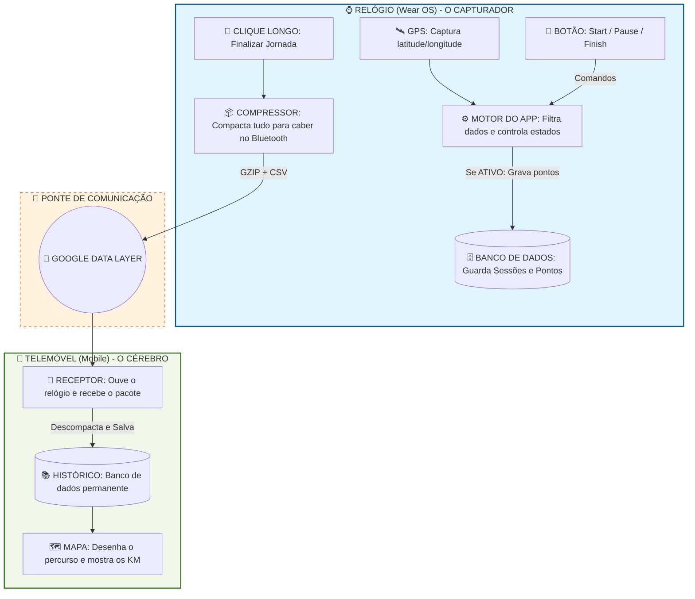
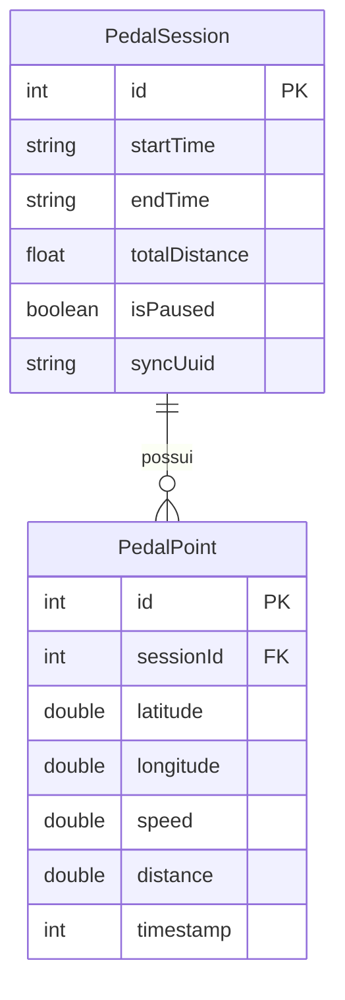

# PedalLog 🚴‍♂️⌚

PedalLog é um aplicativo de rastreamento de ciclismo projetado focado em relógios **Wear OS**. Ele atua como um capturador inteligente de dados, desenhado para economizar bateria com recursos modernos como **Ambient Mode** e **Auto-Pause**, além de sincronizar de maneira eficiente o percurso finalizado com o seu smartphone via **Google Play Services Data Layer**.

## 🏗️ Arquitetura do Sistema

A comunicação e a persistência de dados do PedalLog foram desenhadas para contornar as limitações do Wear OS (bateria pequena e conexão instável), compactando a rota antes de enviá-la ao celular.

## 🗄️ Modelagem de Dados (Room DB)

A persistência local no relógio utiliza duas tabelas primárias que funcionam offline e servem como fonte da verdade até que a sincronização seja confirmada:

## 🛠️ Funcionalidades Embutidas no Relógio

- **Máquina de Estados de Sessão**: Suporte completo a Start, Pause e Resume de pedaladas.
- **Auto-Pause & Auto-Resume Inteligente**: O GPS detecta quando a bicicleta para (< 0.5 m/s) e entra em modo de economia de energia, alterando a frequência de rastreamento e emitindo *feedback háptico* de vibração.
- **Prevenção contra Burn-in**: O design em *Ambient Mode* desloca levemente os pixels em background a cada minuto e reverte os painéis brilhantes em contornos super contrastantes, poupando bateria e sua tela OLED.
- **Compressão GZIP & CSV**: Para não esbarrar no limite de 100 KB imposto pela Google para pacotes de DataItem enviados por Bluetooth/Wi-Fi, as coordenadas completas de 1 hora de pedal passam de ~160 KB para meros ~30 KB.

## 🚀 Próximos Passos
O núcleo do relógio (O Capturador) já está completamente maduro. A próxima fase envolve estruturar o pacote `app-mobile` que implementará os "Listeners" do *Google Data Layer* para extrair o `UUID` da pedalada e plotar a trilha GZIP em um Google Maps definitivo.
